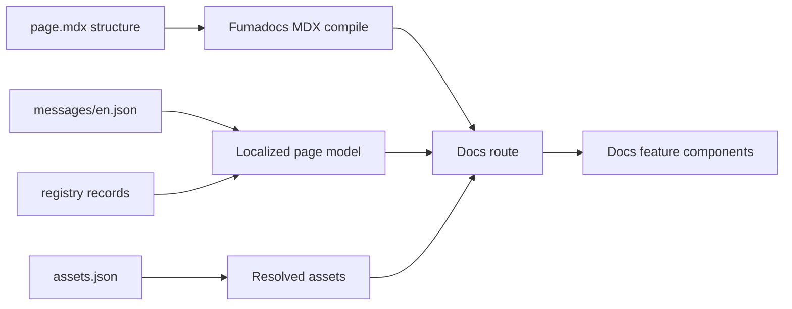

# PRD: Canonical Docs Template Rendering (Grouped-Query Attention)

## Introduction

Implement the Phase 1 canonical module docs rendering path for **grouped-query attention** so readers can open one real reference page and see localized message keys, resolved asset references, registry-backed tag pills, citations, and a minimal taxonomy-derived related-documents section working inside the standard docs shell.

**Intent:** Prove the content model end-to-end (`page.mdx` + colocated messages/assets + registry records → rendered page) and establish the reusable rendering pattern for every future module, model, and concept page.

## Context

### Customer ask

Phase 1: implement canonical docs rendering for the grouped-query attention module page using localized message keys, resolved asset references, tag pills, citations, and a minimal derived related-documents section.

### Problem

Model Atlas defines canonical docs pages as MDX structure plus colocated messages, assets, and registry records—not raw prose in MDX. The project has authoring templates and architecture contracts, but readers cannot yet open `/docs/modules/grouped-query-attention` and see localized text, resolved media, tag pills, citations, and derived related links composed together in the docs shell.

Without this slice, Phase 1 cannot validate that the content model produces a coherent, browsable reference page customers can trust.

### Solution

Wire Fumadocs MDX to docs feature components, resolve colocated messages and assets at render time through `src/lib/content` loaders (from `content-registry-validation`), and publish the grouped-query attention page following `docs/templates/module.mdx`. Render `TagPillList`, `CitationList`, and a minimal `DerivedRelatedDocs` limited to `same-variant-group` for Phase 1.

### Prerequisites (sibling work items)

- **`site-app-scaffold`:** Next.js App Router, Fumadocs docs routing, MDX compilation, docs shell layout, Makefile quality gates.
- **`content-registry-validation`:** Zod schemas, registry/message/asset loaders, `module.grouped-query-attention` record, citation/tag records, colocated `messages/en.json` and `assets.json` fixtures for the GQA page directory.

This work item does **not** own home, search, tag landing pages, Orama indexing, or registry schema/validation logic.

## Description

Deliver canonical module page **rendering** for grouped-query attention: message-key components (`T`, `Section`), asset resolution by `assetId`, registry-backed discovery components (`TagPillList`, `CitationList`, `DerivedRelatedDocs`), and a published `page.mdx` that follows the module template with structure-only MDX.

## Goals

- Prove one fully working canonical module page (grouped-query attention) inside the docs shell.
- Keep MDX structural; resolve all reader-facing copy through colocated message keys.
- Resolve page media through `assets.json` and message-backed alt/caption keys.
- Surface registry-backed tags, citations, and variant-group related modules with visible reason labels.
- Catch resolution and derivation regressions with targeted automated tests—not repo inventory scans.

## Project-level acceptance criteria

- [ ] A reader can open `/docs/modules/grouped-query-attention` locally and see a complete module reference inside the standard docs shell (nav, sidebar, article, on-this-page rail).
- [ ] Title, problem statement, core idea, and rendered section copy come from colocated `messages/en.json` via message-key components—no raw user-visible prose in `page.mdx`.
- [ ] At least one `assetId` on the GQA page resolves to a visible asset slot with alt text from messages.
- [ ] Tags on the module record render as keyboard-focusable tag pills linking to `/tags/<slug>` or an equivalent tag-filter URL.
- [ ] Citations on the module record render in References with MLA text and working outbound source links.
- [ ] `DerivedRelatedDocs` renders the `same-variant-group` when peers exist, with per-link reason labels; empty groups are omitted.
- [ ] Typecheck, lint, and tests pass for all changes in this work item.

## User stories

### docs-template-rendering-001: Message-key rendering in docs MDX

**Description:** As a reader, I want page text to resolve from localized message files so MDX stays structural and future locales can ship without rewriting templates.

**Acceptance criteria:**

- [ ] Fumadocs MDX component map exposes `T` and `Section` with access to the active page’s colocated messages (default locale `en`).
- [ ] `T` renders the string for a given key; `Section` renders its heading from `titleKey`.
- [ ] Missing required keys (`title`, `problemStatement`, `coreIdea`, and any section keys used on the GQA page) surface a clear developer-visible error in development—not silent empty production output.
- [ ] Automated tests cover message lookup for a fixture page (happy path and missing-key behavior).
- [ ] Typecheck passes
- [ ] Tests pass

### docs-template-rendering-002: Asset resolution and rendering by asset ID

**Description:** As a reader, I want diagrams and images to load from declared asset config so maintainers never scatter media paths through MDX.

**Acceptance criteria:**

- [ ] Given a valid `assetId` referenced on the GQA page, the renderer shows a visible asset slot (image, graph shell, or explicit loading placeholder) using colocated `assets.json`.
- [ ] Alt text and caption (when configured) resolve through message keys referenced by the asset config.
- [ ] Invalid `assetId` or broken asset config fails build-time validation or shows an explicit development error—not a broken image with no explanation.
- [ ] Automated tests cover asset resolution for at least one image-type and one graph-type fixture.
- [ ] Typecheck passes
- [ ] Tests pass

### docs-template-rendering-003: Publish and render the grouped-query attention module page

**Description:** As a reader researching attention variants, I want a grouped-query attention page that follows the canonical module template so I can learn what GQA is and why it matters.

**Acceptance criteria:**

- [ ] `src/content/docs/modules/grouped-query-attention/page.mdx` follows the module template with `registryId: module.grouped-query-attention`, `messageNamespace: local`, `assetNamespace: local`, and required frontmatter.
- [ ] The page renders problem statement and core idea below the title via message keys only.
- [ ] `ModuleMetadataCard` and `ModuleAtAGlance` display registry-backed fields for the GQA record.
- [ ] Navigating to `/docs/modules/grouped-query-attention` returns HTTP 200 with the docs shell in a local dev build.
- [ ] Typecheck passes
- [ ] Verify in browser: title and opening paragraphs match `messages/en.json`, not hard-coded MDX prose.

### docs-template-rendering-004: Clickable tag pills on the module page

**Description:** As a reader, I want to click tags on the module page to explore related topics such as attention and kv-cache.

**Acceptance criteria:**

- [ ] `TagPillList` renders one pill per tag on the module registry record using localized tag titles where available.
- [ ] Each pill is a keyboard-focusable link to `/tags/<slug>` or an equivalent search URL with that tag applied.
- [ ] Pills use restrained monochrome styling per `docs/site-fundamentals.md`.
- [ ] When the registry record has no tags, the component renders nothing (no empty heading).
- [ ] Typecheck passes
- [ ] Verify in browser: GQA page shows expected tags and each pill navigates to a working destination.

### docs-template-rendering-005: Citations in the References section

**Description:** As a reader, I want cited sources with MLA formatting so technical claims on the module page are grounded.

**Acceptance criteria:**

- [ ] `CitationList` renders each `citationId` on the module record with MLA text from the citation registry record.
- [ ] Each citation includes an outbound link opening the canonical source URL in a new tab with `rel="noopener noreferrer"`.
- [ ] When `citationIds` is empty, References shows a concise empty state or omits the list—never broken partial markup.
- [ ] Automated tests cover MLA rendering for at least one fixture citation record.
- [ ] Typecheck passes
- [ ] Tests pass
- [ ] Verify in browser: GQA References lists expected sources with working links.

### docs-template-rendering-006: Minimal derived related documents

**Description:** As a reader comparing attention mechanisms, I want nearby variants grouped with clear reasons so authors do not hand-maintain related link lists in MDX.

**Acceptance criteria:**

- [ ] `DerivedRelatedDocs` on the GQA page renders the `same-variant-group` when peer module records exist in the registry.
- [ ] Each related item shows a title link to the peer docs page and a visible reason label (for example “Same variant group”).
- [ ] Groups with zero matches are not rendered.
- [ ] Automated tests verify variant-group peers are selected for a fixture registry set.
- [ ] Typecheck passes
- [ ] Tests pass
- [ ] Verify in browser: GQA page shows related attention variants with reason labels when peer records exist.

## High-level technical design

### Rendering pipeline

1. **Load:** Docs route loads page frontmatter, colocated messages for locale, colocated asset config, and registry record for `registryId`.
2. **Resolve:** `src/lib/content/messages.ts` and `assets.ts` (from prerequisite work) build a typed localized page model.
3. **Compose:** Fumadocs MDX component map exposes `T`, `Section`, `TagPillList`, `CitationList`, `DerivedRelatedDocs`, and module components under `src/features/docs` and `src/features/models`.
4. **Render:** Presentation components consume resolved models and registry lookups only—no ad hoc JSON parsing in UI layers.

### Package ownership

| Concern | Owner |
|--------|--------|
| Message/asset resolution, schemas, validation | `src/lib/content` (prerequisite) |
| MDX primitives (`T`, `Section`, citations, related, tags) | `src/features/docs/components` |
| Module cards, at-a-glance | `src/features/models/components` |
| Route wiring | `src/app/docs/[[...slug]]/page.tsx` |
| Authoring reference | `docs/templates/module.mdx` |

### GQA page scope (Phase 1 basic)

**Included:** title, problem statement, core idea, metadata/at-a-glance, tag pills, core explanatory sections through practical benefit, variants section with minimal `DerivedRelatedDocs` (`same-variant-group` only), References with `CitationList`, at least one resolved asset.

**Deferred:** full interactive React Flow graphs, populated comparison tables, `ModelsUsingModule` until example models publish, additional `DerivedRelatedDocs` groups beyond `same-variant-group`.

## Functional requirements

- **FR-1:** Canonical module MDX must not contain raw user-visible prose outside approved components (`T`, `Section`, registry-backed components).
- **FR-2:** `messageNamespace: local` resolves keys from `messages/<locale>.json` adjacent to the page.
- **FR-3:** `assetNamespace: local` resolves IDs from colocated `assets.json`.
- **FR-4:** `TagPillList` accepts `registryId` and renders linked pills for all tags on that record.
- **FR-5:** `CitationList` accepts `registryId` and renders MLA text plus URL for each citation record.
- **FR-6:** `DerivedRelatedDocs` accepts `registryId` and `groups`; Phase 1 minimal scope supports `same-variant-group` with reason labels.
- **FR-7:** GQA frontmatter `registryId` is `module.grouped-query-attention` with `kind: module`.
- **FR-8:** Standard docs shell wraps the page without a one-off layout.

## Non-goals

- Home, search dialog, tag index, and tag landing pages (`default-pages-search-tags`).
- Orama search indexing and ranking.
- PDF/print routes and Playwright export.
- Full graph interactivity (expand/collapse, fit view) beyond a static or loading placeholder.
- Locales beyond default `en`.
- Other page kinds (model, paper, concept, glossary).
- Final editorial completeness for every module template section—only enough GQA copy to validate rendering.
- Hand-maintained related link lists when derivation can supply them.
- Re-implementing registry schemas, loaders, or `make validate-data` (owned by `content-registry-validation`).

## Supporting technical and UX considerations

- **Accessibility:** Logical heading outline; tag pills and citation links keyboard-operable; focus rings use `ring` token.
- **States:** Loading placeholders for async graph assets; empty states for citations and related groups; development errors for missing keys/assets must not ship as blank production sections.
- **Styling:** Follow `docs/site-fundamentals.md`—dark docs shell, monochrome chips, restrained `primary`/`accent` usage.
- **Testing:** Unit/integration tests target message resolution, asset resolution, citation MLA formatting, and variant-group derivation—not file-path inventories.

## Success metrics

- A reviewer completes the Phase 1 manual check on the GQA page: message-driven copy, working tag navigation, outbound citations, and at least one related variant with a reason label.
- Message, asset, or derivation regressions fail automated tests without manual inspection.
- The next module page can copy the GQA folder pattern without a new rendering approach.

## Open questions

None blocking Phase 1. Graph interactivity depth can follow once registry graph records mature; this work only requires a resolvable asset slot and message-backed alt text.
